

  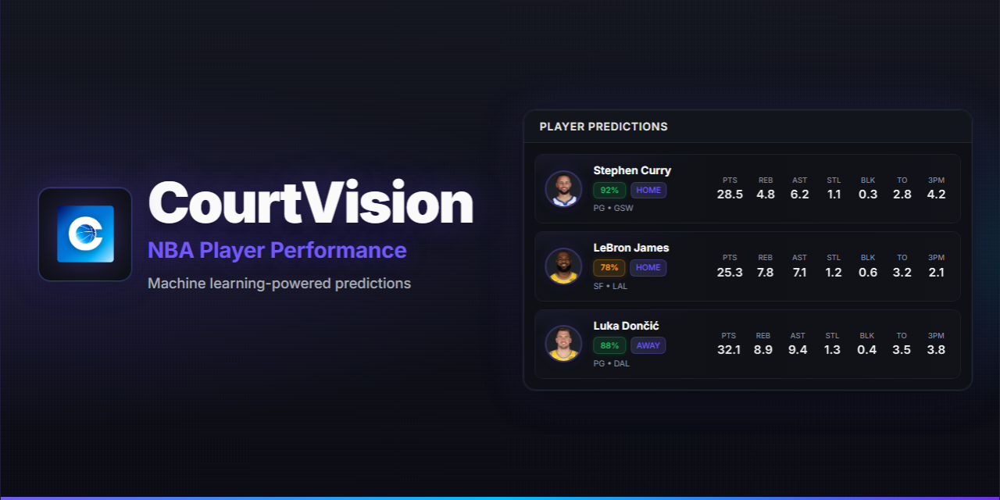

---

CourtVision is a desktop application that provides advanced analytics and machine learning-powered predictions for NBA player performance. The application combines comprehensive player statistics, team analysis, and ensemble machine learning models to forecast player statistics for upcoming games.

---

## Table of Contents

1. [Overview](#overview)
2. [How Predictions Are Made](#how-predictions-are-made)
3. [Features](#features)
4. [Installation](#installation)
5. [Uninstallation](#uninstallation)
6. [Getting Started](#getting-started)
7. [User Guide](#user-guide)
   - [Predictions](#predictions)
   - [Player Analysis](#player-analysis)
   - [Pick Finder](#pick-finder)
   - [Trends](#trends)
   - [Saved Picks](#saved-picks)
   - [Analytics](#analytics)
   - [Community](#community)
   - [Friends and Groups](#friends-and-groups)
   - [Messages](#messages)
   - [Model Performance](#model-performance)
   - [Settings](#settings)
8. [System Requirements](#system-requirements)
9. [Technical Documentation](#technical-documentation)
10. [Support](#support)
11. [Authors](#authors)

---

## Overview

CourtVision leverages an ensemble of machine learning models (XGBoost, LightGBM, CatBoost, and Random Forest) to predict player statistics including points, rebounds, assists, steals, blocks, turnovers, and three-pointers made. The application provides:

- Real-time predictions for upcoming NBA games
- Comprehensive player performance analysis with interactive visualizations
- Advanced search and filtering tools to discover optimal picks
- Historical trend analysis and pattern recognition
- Social features for sharing and discussing picks
- Model performance metrics and confidence scoring

The application is built as a desktop application using Electron, currently available for Windows devices.

---

## How Predictions Are Made

CourtVision uses an ensemble approach combining four machine learning algorithms to generate predictions. Each model is trained on over 150 features derived from historical player, team, and opponent data, using only information available before the game to prevent data leakage.

### The Ensemble Models

- **XGBoost**: Provides strong regularization to prevent overfitting
- **LightGBM**: Fast training with the ability to capture complex patterns
- **CatBoost**: Effectively handles categorical data
- **Random Forest**: Delivers stable predictions resistant to outliers

The final prediction is the average of all four models, which helps cancel out individual errors and produces more reliable forecasts.

### Feature Categories

The models consider multiple categories of information:

- **Player Performance**: Rolling averages (last 5, 10, 20 games), exponentially weighted recent stats, per-36 minute rates, shooting percentages, and efficiency metrics
- **Opponent Factors**: Team defensive and offensive ratings, position-specific defense rankings, pace, and points allowed
- **Rest & Schedule**: Days of rest, back-to-back games, schedule density, and season progress
- **Context**: Home/away status, timezone changes, altitude effects, and teammate availability

### Confidence Scores

Each prediction includes a confidence score (0-100) that indicates how favorable conditions are for an accurate prediction. This score considers:

- Ensemble agreement (how closely the four models agree)
- Player consistency (historical variance in stats)
- Data quality (feature completeness)
- Situational factors (injuries, trades, rest days)

For detailed technical information about the machine learning models, feature engineering, and system architecture, please refer to the [Technical Overview](docs/TECHNICAL_OVERVIEW.md) document.

---

## Features

### Core Functionality

- **AI-Powered Predictions**: Ensemble machine learning models generate predictions for multiple player statistics with confidence scores
- **Interactive Player Analysis**: Deep dive into individual player performance with draggable line analysis, historical charts, and contextual insights
- **Advanced Pick Discovery**: Sophisticated filtering system to find picks matching specific criteria
- **Trend Detection**: Automatic identification of performance patterns and streaks
- **Pick Management**: Save, organize, and track your predictions with detailed filtering and sorting options
- **Community Features**: Share picks with friends, join groups, and discover picks from the community
- **Real-Time Updates**: Automatic data synchronization ensures predictions are based on the latest game information

### Analytics and Insights

- **Historical Performance Charts**: Interactive bar charts showing player performance over time with visual hit/miss indicators
- **Context Cards**: Real-time analysis of opponent defense, rest days, star player availability, playoff experience, and pace comparisons
- **Export Capabilities**: Export analysis charts and data as high-quality images for external use
- **Model Performance Metrics**: View accuracy statistics and performance trends for prediction models
- **Advanced Filtering**: Filter predictions by player, team, game date, position, confidence level, and numerous other criteria

### Social Features

- **Friends System**: Connect with other users and view their shared picks
- **Groups**: Create or join groups to share picks with specific communities
- **Messaging**: Direct messaging system for communication with friends
- **Public Picks**: Discover and explore picks shared publicly by the community
- **Pick Sharing**: Share your picks with friends, groups, or the public community

---

## Installation

### Windows

1. Download the latest installer from the [Releases](https://github.com/kennethhuang7/CourtVision/releases) page
2. Run the installer executable
3. **Windows Security Warning**: You may see a Windows security warning stating "Windows protected your PC" or "Unknown publisher." This is expected because our application is not code-signed yet. Click "More info" and then "Run anyway" to proceed with installation. Please only install from our [Releases](https://github.com/kennethhuang7/CourtVision/releases) page, and do not trust any files from any other location!
4. Follow the installation wizard
5. During installation, you can choose the installation directory and configure where related application files (such as exports or error logs) will be stored
6. Launch CourtVision from the Start menu or desktop shortcut

### Uninstallation

To uninstall CourtVision:

1. Open Windows Settings (press `Win + I`)
2. Navigate to **Apps** > **Installed apps** (or **Apps & features** on older Windows versions)
3. Search for "CourtVision" in the list
4. Click on CourtVision and select **Uninstall**
5. Follow the uninstallation prompts

Alternatively, you can uninstall through the Control Panel:
1. Open Control Panel
2. Go to **Programs** > **Programs and Features**
3. Find "CourtVision" in the list
4. Right-click and select **Uninstall**

**Note**: Uninstalling the application will remove the program files, but your exported files and error logs (stored in the directory you configured during installation) will remain on your system unless you manually delete them.

---

## Getting Started

### Account Creation

CourtVision supports multiple registration methods:

**Email Registration:**
1. Launch CourtVision
2. Click "Register" on the welcome screen
3. Enter your email address, display name, username, and password
4. Your password must meet security requirements (8+ characters, uppercase, lowercase, number, special character)
5. Verify your email address using the link sent to your inbox
6. Once verified, you can log in and start using the application

**OAuth Registration (Discord/Google):**
1. Launch CourtVision
2. Click "Register" on the welcome screen
3. Click "Sign up with Discord" or "Sign up with Google"
4. Complete the OAuth authentication in your browser
5. After successful authentication, you'll be redirected to the Complete Profile page
6. Enter your username and display name (display name may be pre-filled from your OAuth provider)
7. Your username must be 3-30 characters, lowercase letters, numbers, and underscores only
8. Click "Continue to Dashboard" to complete your profile and start using the application

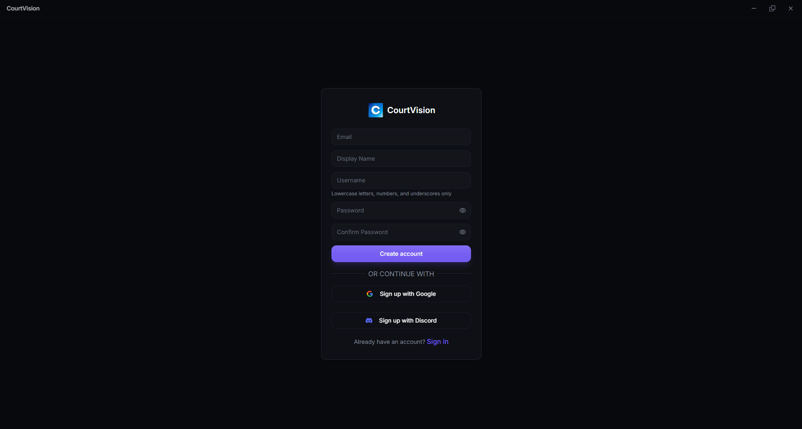

### First Login

1. Enter your email and password on the login screen
2. Upon successful login, you'll be directed to the Predictions page (the default landing page)
3. Explore the various sections using the sidebar navigation
4. Review the "How It Works" page for an overview of the application

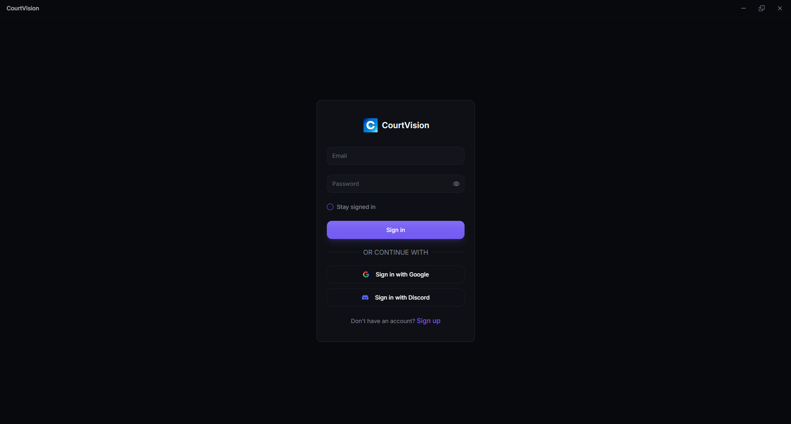

---

## User Guide

### Predictions

The Predictions page is the default landing page and displays AI-generated forecasts for upcoming NBA games. This page serves as your primary interface for discovering and managing predictions.

**Key Features:**

- **Comprehensive Filtering**: Filter by date range, player, team, position, confidence level, and more
- **Flexible Sorting**: Sort by confidence score, game date, player name, or prediction date
- **Grouping Options**: Group predictions by player, team, or game for easier analysis
- **Confidence Indicators**: Color-coded confidence scores help identify high-probability predictions
- **Quick Actions**: Save picks, view player analysis, or navigate to detailed views directly from prediction cards

**To analyze a player from a prediction:**

1. Click on any prediction card to open the player detail modal
2. Click the "Analyze Player" button in the modal
3. You'll be navigated to the Player Analysis page with the selected player, game, and statistic automatically loaded
4. From the Player Analysis page, you can save picks after reviewing the detailed analysis

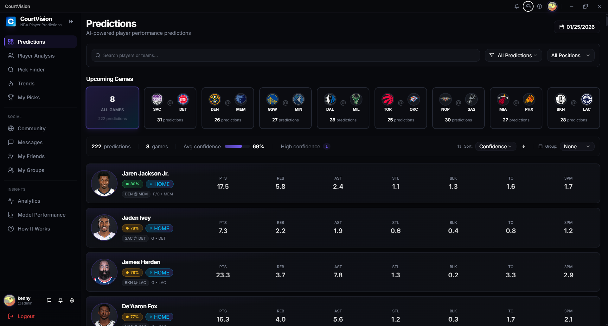

### Player Analysis

The Player Analysis page provides comprehensive insights into individual player performance with powerful interactive tools for deep analysis.

**Core Features:**

- **Player Selection**: Search and select any NBA player from the database
- **Game Selection**: Choose a specific upcoming game or view overall statistics
- **Statistic Selection**: Analyze any of seven statistics (points, rebounds, assists, steals, blocks, turnovers, three-pointers made)
- **Interactive Historical Chart**: Visualize player performance over time with color-coded bars indicating hits and misses
- **Draggable Line Analysis**: Click and drag on the chart to set a custom line value and instantly see how many historical games would have hit or missed that line
- **AI Prediction Display**: View the ensemble model's prediction for the selected game, displayed as a special bar on the chart
- **Context Cards**: Real-time analysis of five key contextual factors:
  - **Opponent Defense**: Position-specific defensive rankings
  - **Rest Days**: Days of rest for both the player's team and opponent
  - **Star Players Out**: Impact of missing star teammates on player performance
  - **Playoff Experience**: Historical playoff performance compared to regular season
  - **Pace Comparison**: Team pace vs. opponent pace and league average
- **Game Log Table**: Detailed table showing recent games with filtering options:
  - Time windows (Last 5, 10, 20, 50 games, or All)
  - Filter by home/away games
  - Filter by head-to-head matchups against the opponent
  - Filter by current team only
  - Filter by current season only
  - Exclude games with zero minutes played
  - Set minimum minutes played threshold
- **Export Functionality**: Export your analysis as a high-quality image with customizable options:
  - Click the "Export" button to open the export modal with live preview
  - Customize what to include: player information, performance chart, context cards, and game log table
  - Choose between light, dark, or current theme
  - Select export quality: Standard (1x), High (2x), or Ultra (3x) resolution
  - Preview your export in real-time before downloading
  - Exported images are saved to your configured export directory

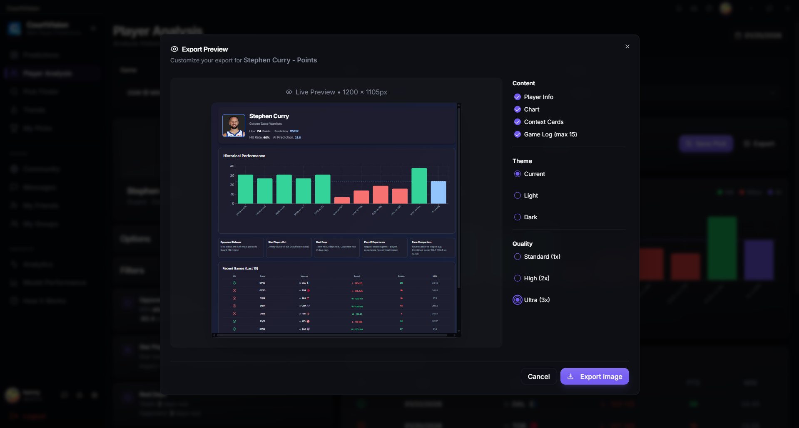

**How to Use the Draggable Line:**

1. Navigate to the Player Analysis page
2. Select a player, game, and statistic
3. Click and drag vertically on the historical performance chart
4. The line value updates in real-time as you drag
5. The chart automatically recalculates which historical games would have hit or missed the new line
6. Use this feature to test different line values and understand the player's historical performance at various thresholds

**To analyze a player:**

1. Navigate to the Player Analysis page from the sidebar
2. Use the search box to find a player by name
3. Select a game date from the calendar picker
4. Choose a statistic from the dropdown menu
5. Review the interactive chart, context cards, and game log
6. Adjust the draggable line to explore different scenarios
7. Save picks directly from the analysis page

**Value from Player Analysis:**

The Player Analysis page enables you to make informed decisions by providing:
- Historical performance patterns at different line values
- Contextual factors that may influence performance
- Visual representation of consistency and variance
- Comparison between AI predictions and historical averages
- Ability to test multiple scenarios before making a pick

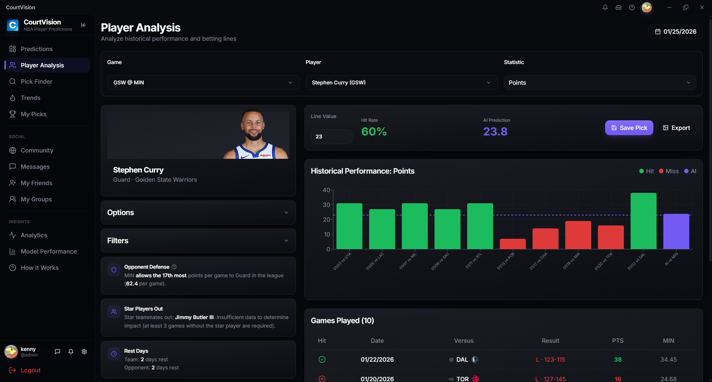

### Pick Finder

The Pick Finder is an advanced search tool that helps you discover picks matching specific criteria across all upcoming games. This powerful feature allows you to construct complex queries to find the exact types of picks you're looking for.

**Search Capabilities:**

- **Performance Filters**:
  - Time window selection (Last 5, 10, 20, or 50 games)
  - Minimum hit rate requirements (percentage or count-based)
  - Consecutive hit requirements
  - Custom line modifiers (adjust lines up or down)
  - Separate analysis for home/away splits
  - Head-to-head matchup analysis
- **Matchup Filters**:
  - Opponent defense rankings (position-specific and team-wide)
  - Pace requirements (faster, slower, or any pace)
  - Exclude tired vs. rested scenarios
- **Context Filters**:
  - Context-based time windows
  - Context hit rate requirements
  - Context consecutive hit requirements
- **AI Agreement**:
  - Require AI model agreement (all models, majority, or disabled)
  - Minimum confidence score thresholds
- **Player Requirements**:
  - Minimum minutes played
  - Player role filtering
  - Separate playoff statistics

**How to Use Pick Finder:**

1. Navigate to the Pick Finder page from the sidebar
2. Configure your search criteria using the filter panels
3. Expand or collapse filter sections as needed
4. Click "Search" to find matching picks
5. Review results sorted by strength
6. Click on any result to view detailed analysis
7. Save picks directly from the results

**Value from Pick Finder:**

The Pick Finder enables you to:
- Discover picks that match your specific strategy
- Find players with strong historical performance patterns
- Identify favorable matchups based on defense and pace
- Filter by AI confidence to focus on high-probability picks
- Save time by automatically finding picks that meet complex criteria

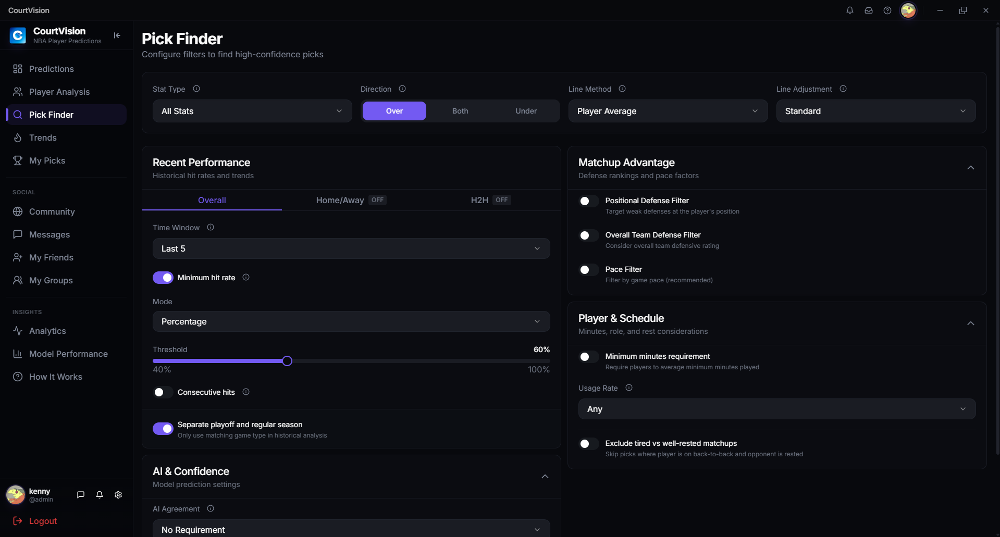

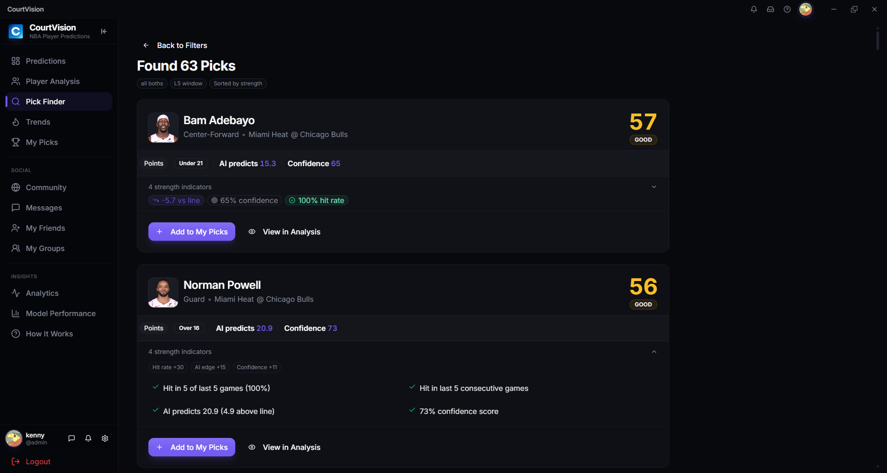

### Trends

The Trends page automatically identifies and displays performance patterns and streaks across the league. This feature helps you discover players who are currently trending in specific statistics.

**Trend Types:**

- **Recent Form**: Players performing above or below their average in recent games
- **Head-to-Head**: Players with strong historical performance against specific opponents
- **Home/Away Splits**: Players with significant home or away performance differences

**Trend Features:**

- **Hit Rate Display**: Shows the percentage and count of games where the trend held (e.g., "75% (12/16)")
- **Visual Indicators**: Flame icons indicate trend strength (based on hit rate and consistency)
- **Streak Information**: Displays consecutive hits when applicable
- **Filter Options**:
  - Filter by statistic type
  - Filter by over/under direction
  - Filter by trend type
  - Set minimum streak requirements
  - Adjust line calculation methods
  - Require AI model agreement
- **Detailed Views**: Click on any trend to see:
  - Last 10 games performance
  - Head-to-head history against the opponent
  - Home/away splits
  - Visual charts and game-by-game breakdowns

**How to Use Trends:**

1. Navigate to the Trends page from the sidebar
2. Adjust filters to focus on specific trend types
3. Browse the list of trending picks
4. Click on any trend to view detailed analysis
5. Review historical performance in the detail view
6. Save picks directly from trend details

**Value from Trends:**

The Trends page helps you:
- Quickly identify players in strong form
- Discover matchup advantages
- Find players with consistent patterns
- Stay updated on league-wide performance trends
- Make data-driven decisions based on recent performance

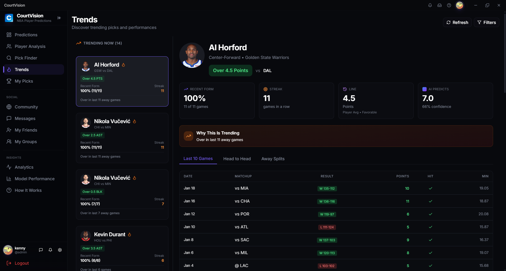

### Saved Picks

The Saved Picks page allows you to manage and track all your saved predictions in one centralized location.

**Management Features:**

- **Status Filtering**: Filter by pending, win, or loss status
- **Date Range**: Filter picks by game date or creation date
- **Search**: Search by player name, team, or statistic
- **Sorting**: Sort by various criteria including date, player, status, and more
- **Performance Tracking**: View win/loss statistics and success rates
- **Export**: Export your picks to CSV format for external analysis

**To manage your picks:**

1. Navigate to the Saved Picks page from the sidebar
2. Use filters and search to find specific picks
3. View detailed information for each pick
4. Track performance as games complete
5. Export data for external analysis if needed

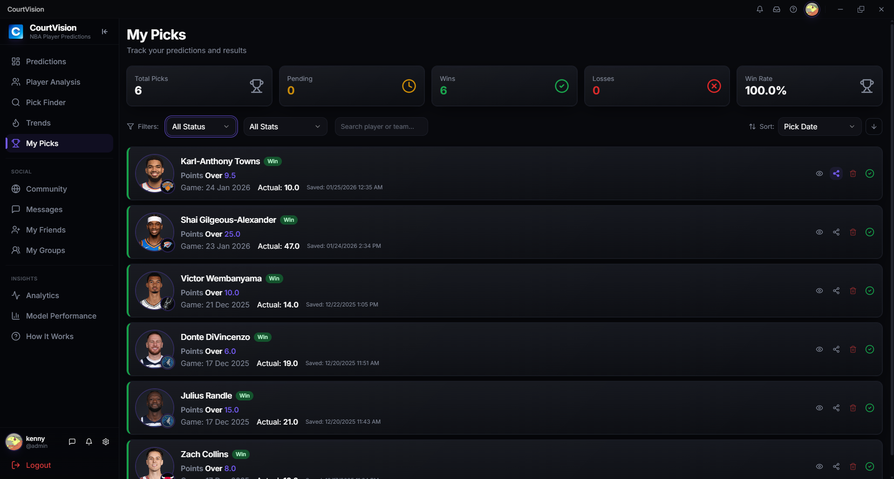

### Analytics

The Analytics page provides comprehensive insights into your pick performance, helping you understand your strengths, weaknesses, and trends over time.

**Performance Metrics:**

- **Win Rate Visualization**: Interactive ring chart showing your overall win rate or win rate by specific statistic (points, rebounds, assists, etc.)
- **Over vs Under Performance**: Compare your success rate with over picks versus under picks
- **Recent Form**: Track your performance across different time periods:
  - Last 7 Days
  - Last 30 Days
  - Last 90 Days
- **Top Players by Win Rate**: See which players you've had the most success with, ranked by win rate
- **Overall Statistics**: View total picks, win/loss records, current streak, and best winning streak

**Interactive Features:**

- **Statistic Filtering**: Filter win rate analysis by specific statistics (overall, points, rebounds, assists, steals, blocks, turnovers, three-pointers)
- **Clickable Cards**: Click on any performance card to view detailed breakdowns:
  - Click on Over/Under cards to see all picks of that type
  - Click on Recent Form periods to see picks from that time window
  - Click on Top Players to see all picks for that specific player
- **Visual Indicators**: Color-coded performance metrics (green for good performance, red for poor performance)
- **Animated Visualizations**: Smooth animations for win rate rings and progress bars

**How to Use Analytics:**

1. Navigate to the Analytics page from the sidebar
2. Review your overall win rate in the main ring chart
3. Use the dropdown to filter by specific statistics
4. Compare your Over vs Under performance to identify patterns
5. Check your Recent Form to see if you're improving or declining
6. Review Top Players to see which players you should focus on
7. Click on any card to view detailed pick breakdowns

**Value from Analytics:**

The Analytics page helps you:
- Identify which types of picks you're most successful with
- Track your performance trends over time
- Discover which players you have the best track record with
- Understand whether you perform better with over or under picks
- Make data-driven decisions about which strategies work best for you

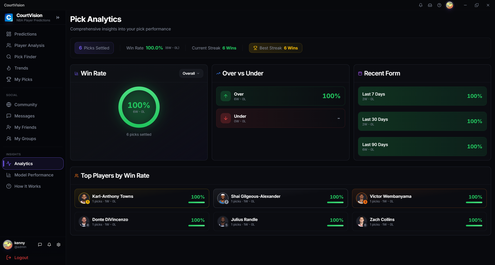

### Community

The Community page enables you to discover and interact with picks shared by other users across the platform.

**Community Features:**

- **Filter Views**: Switch between three visibility levels:
  - **Friends**: Picks shared by your friends
  - **Groups**: Picks shared within groups you're a member of
  - **Public**: Picks shared publicly by any user
- **Search**: Search picks by username, display name, or group name
- **Advanced Filtering**: Filter by statistic type, result status, and date
- **Tail Picks**: Copy picks from other users directly to your saved picks
- **User Profiles**: View detailed profiles of pick creators
- **Group Information**: Explore group details and membership

**To tail a pick:**

1. Browse the Community page
2. Find a pick you're interested in
3. Click the copy icon on the pick card
4. The pick will be added to your Saved Picks automatically

**To view a user profile:**

1. Click on a username in any pick card
2. View the user's profile, shared picks, and statistics
3. Send a friend request if desired

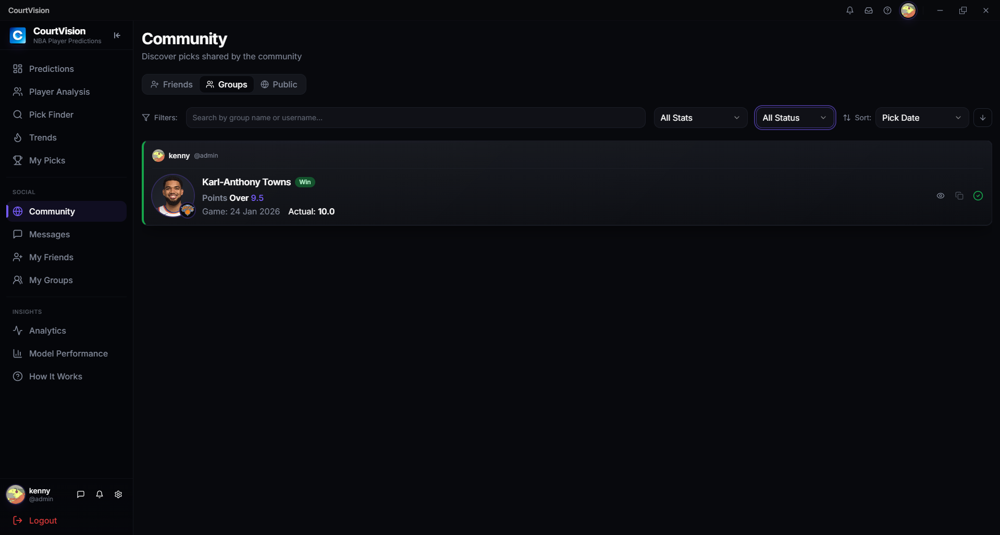

### Friends and Groups

#### Friends

The Friends page allows you to manage your social connections within the application.

**Friend Features:**

- **Friend Requests**: Send and receive friend requests
- **Friend List**: View all your friends and their activity
- **User Search**: Search for users by username
- **Profile Viewing**: View friend profiles and their shared picks
- **Activity Tracking**: See when friends share new picks

**To add a friend:**

1. Navigate to the Friends page
2. Use the search function to find a user by username
3. Click "Send Friend Request"
4. Once accepted, you'll see their picks in the Community section under "Friends"

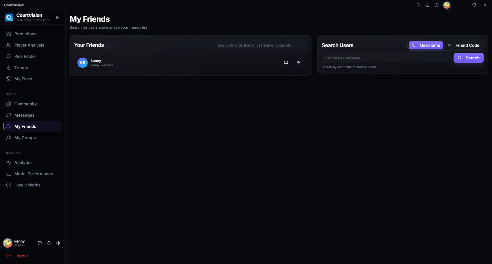

#### Groups

The My Groups page enables you to create and manage groups for sharing picks with specific communities.

**Group Features:**

- **Create Groups**: Create new groups with custom names and descriptions
- **Group Management**: Manage group members, settings, and permissions
- **Group Discovery**: Browse and join public groups
- **Group Picks**: View picks shared within specific groups
- **Privacy Controls**: Set group visibility and membership requirements

**To create a group:**

1. Navigate to the My Groups page
2. Click "Create Group"
3. Enter group name and description
4. Set privacy settings (public or private)
5. Invite members or make the group open for joining

**To share a pick to a group:**

1. Save a pick from any page
2. When saving, select group visibility
3. Choose which groups to share with
4. Group members will see your pick in the Community section

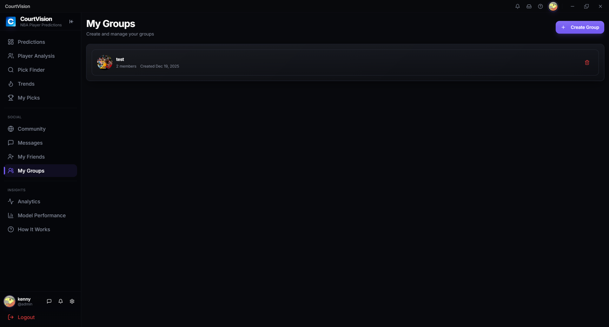

### Messages

The Messages page provides a direct messaging interface for communication with friends and group members.

**Messaging Features:**

- **Conversation List**: View all your active conversations
- **Message Threads**: Navigate between different conversations
- **Real-Time Updates**: Receive notifications for new messages
- **Message History**: Access full conversation history
- **User Profiles**: Quick access to user profiles from conversations

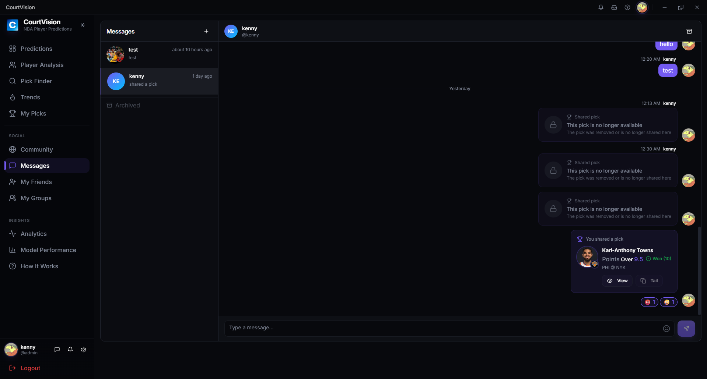

### Model Performance

The Model Performance page provides insights into the accuracy and reliability of the prediction models and allows you to configure which models are used in the ensemble.

**Ensemble Configuration:**

- **Model Selection**: Choose which models to include in predictions (XGBoost, LightGBM, CatBoost, Random Forest)
- **Ensemble Display**: View which models are currently active in your ensemble
- **Model Comparison**: Compare performance across different models and the ensemble
- **Customizable Colors**: Set custom colors for each model in performance charts

**Performance Metrics:**

- **Mean Absolute Error (MAE)**: View prediction accuracy across different statistics for each model
- **Time Period Selection**: Analyze performance over different time periods (Last 7, 30, 90, 180 days, or All Time)
- **Grouping Options**: View performance data grouped by day, week, or month
- **Statistic Filtering**: Filter performance metrics by specific statistics or view overall performance
- **Performance Over Time**: Interactive line charts showing how model accuracy changes over time
- **Comparison Table**: Side-by-side comparison of MAE across all models and statistics

**How to Configure Models:**

1. Navigate to the Model Performance page from the sidebar
2. In the "Ensemble Configuration" section, check or uncheck the models you want to include
3. At least one model must be selected for predictions to work
4. The ensemble will automatically average predictions from all selected models
5. Performance metrics will update to reflect your current model selection

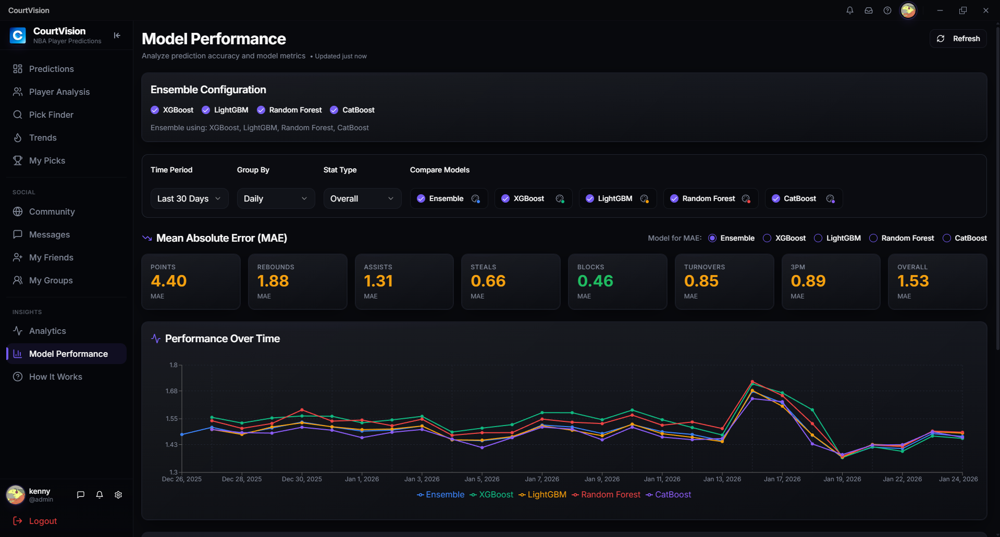

### Settings

The Settings page allows you to customize your application experience across multiple categories.

#### Appearance

- **Theme**: Switch between light and dark themes
- **UI Density**: Adjust spacing and component sizes (Compact, Comfortable, Spacious)
- **Font Size**: Customize text size for better readability
- **Zoom Level**: Adjust overall UI scale (Discord-style scaling that affects component sizes without changing viewport)

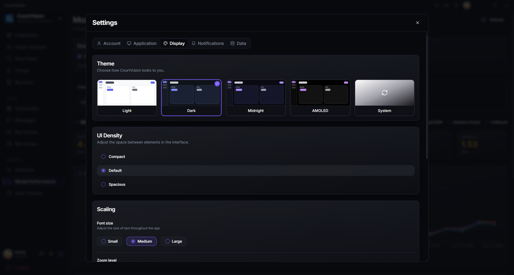

#### Application

- **Start with System**: Launch CourtVision automatically on system startup
- **Minimize to Tray**: Keep the application running in the system tray when closed
- **File Locations**: Configure where exported files and error logs are stored
- **Update Settings**: Configure automatic update preferences and check for updates manually

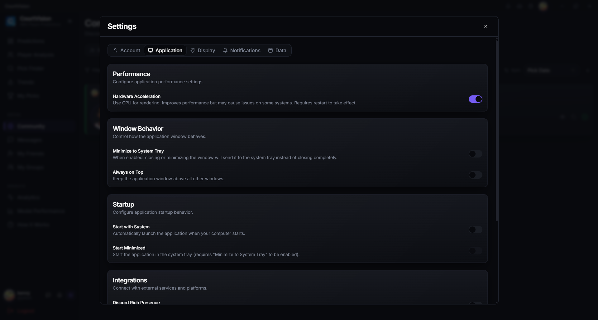

#### Account

- **Profile Information**: Update your display name, username, and bio
- **Email Settings**: Change your email address
- **Privacy Settings**: Control who can see your picks and profile
- **Account Management**: Delete your account if needed

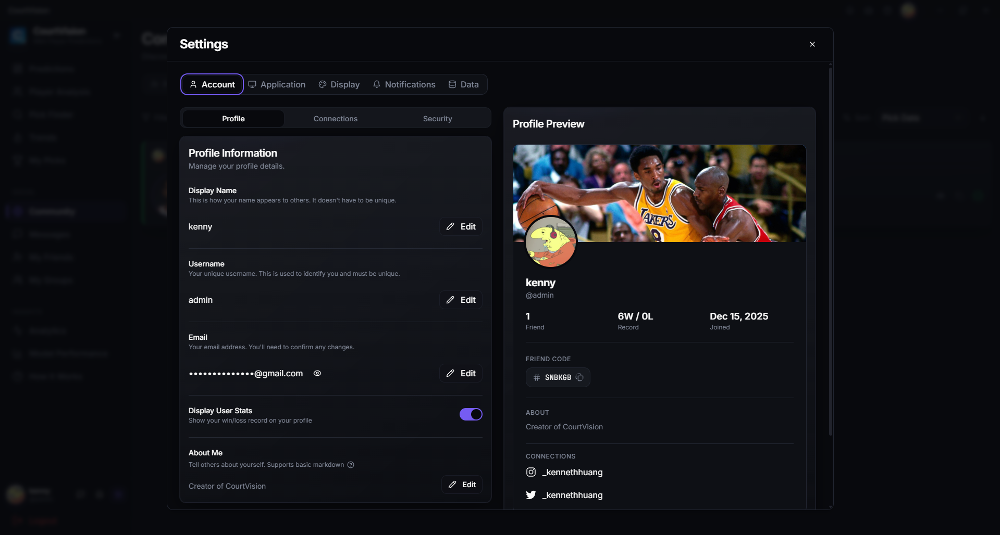

#### Cache Management

CourtVision uses intelligent caching to improve performance and enable offline functionality:

- **Prediction Cache**: Predictions are automatically cached locally for faster loading
- **Cache Retention**: Configure how long cached predictions are stored (7, 14, 30, 60, 90, 180 days, or keep all)
- **Model Performance Cache**: Cache model performance queries for faster loading (can be enabled or disabled)
- **Automatic Updates**: Recent games are automatically updated in the background when viewed
- **Offline Support**: View cached predictions and data when offline
- **Storage Management**: View cache storage usage and item counts
- **Cache Management**: View all cached entries, delete specific entries, or clear all cache
- **Health Monitoring**: Automatic connection health checks ensure cached data is used when appropriate

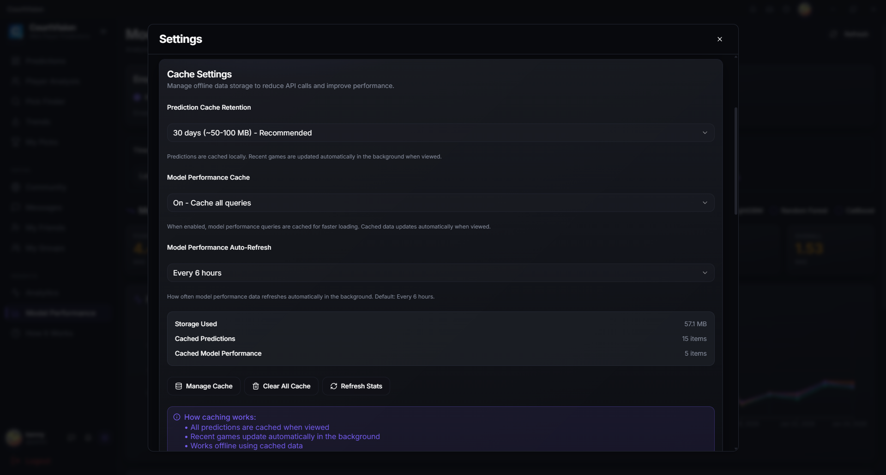

---

## System Requirements

### Minimum Requirements

- **Operating System**: Windows 10 (64-bit) or later
- **RAM**: 4 GB
- **Storage**: 500 MB available space

### Recommended Requirements

- **Operating System**: Windows 11 (64-bit)
- **RAM**: 8 GB or more
- **Storage**: 1 GB available space

---

## Technical Documentation

For detailed technical information about the machine learning models, feature engineering, model training process, and prediction workflow, please refer to the [Technical Overview](docs/TECHNICAL_OVERVIEW.md) document.

---

## Support

### Getting Help

If you encounter any issues or have questions:

1. Check the "How It Works" page within the application for an overview of features
2. Review this documentation for detailed usage instructions
3. Check the [Issues](https://github.com/kennethhuang7/CourtVision/issues) page for known issues
4. Create a new issue with detailed information about your problem

### Reporting Bugs

When reporting bugs, please include as much of the following as possible:

- Operating system and version
- Application version
- Steps to reproduce the issue
- Expected behavior
- Actual behavior
- Screenshots if applicable
- Error messages or logs (found in the configured error log directory)

### Troubleshooting

#### Predictions Not Loading

- **Check your internet connection**: Predictions require an active internet connection to fetch the latest data
- **Verify cache settings**: If predictions are cached, try clearing the cache in Settings > Cache Management
- **Check for updates**: Ensure you're running the latest version of the application
- **Review error logs**: Check the error log directory (configured in Settings) for detailed error messages

#### Charts Not Rendering

- **Refresh the page**: Navigate away and back to the Player Analysis page
- **Check data availability**: Ensure the selected player has historical game data for the selected statistic
- **Clear browser cache**: If using cached data, try clearing the application cache
- **Restart the application**: Close and reopen CourtVision if charts continue to fail

#### Export Functionality Issues

- **Verify export directory**: Go to Settings > Application and verify that the export directory path is correct and points to a valid folder. If the folder doesn't exist or is inaccessible, update the path to a different location
- **Check disk space**: Ensure you have sufficient disk space for image exports (high-quality exports can be several MB each)
- **Try different quality settings**: If exports fail, try a lower quality setting (Standard instead of Ultra) to reduce file size and processing requirements
- **Check file permissions**: Ensure the export directory folder in Settings allows write access. If you're unsure, try changing the export directory to a different location (such as your Documents folder) in Settings > Application

#### Installation Errors

- **Windows compatibility**: Ensure you're running Windows 10 (64-bit) or later
- **Antivirus interference**: Temporarily disable antivirus software during installation if it blocks the installer
- **Administrator privileges**: Right-click the installer and select "Run as administrator"
- **Previous installation**: [Uninstall any previous versions](#uninstallation) before installing a new version

#### Performance Issues

- **Clear cache**: Large cache files can slow down the application. Clear cache in Settings > Cache Management
- **Check system resources**: Ensure you have sufficient RAM (4GB minimum, 8GB recommended)
- **Close other applications**: Free up system resources by closing unnecessary applications

#### Data Not Updating

- **Check internet connection**: Data updates require an active internet connection
- **Manual refresh**: Use the refresh button on relevant pages to force a data update
- **Cache settings**: Verify cache retention settings in Settings > Cache Management
- **Check update schedule**: Recent games are automatically updated in the background when viewed

#### Login or Authentication Issues

- **Verify credentials**: Double-check your email and password
- **OAuth issues**: If using Discord or Google OAuth, ensure pop-ups are not blocked
- **Email verification**: For email registration, check your inbox for the verification link
- **Reset password**: Use the password reset option if you've forgotten your password

---

## Authors

**Kenneth Huang** - Creator and Lead Developer
- **GitHub**: [@kennethhuang7](https://github.com/kennethhuang7)
- **LinkedIn**: [Kenneth Huang](https://www.linkedin.com/in/kennethhuang7)

---

**Questions?** Open an issue on [GitHub](https://github.com/kennethhuang7/CourtVision/issues)

**Enjoying CourtVision?** Give us a star ⭐ on [GitHub](https://github.com/kennethhuang7/CourtVision)

**Version**: 1.0.0  
**Last Updated**: January 2025

---

[Back to Top](#table-of-contents)

